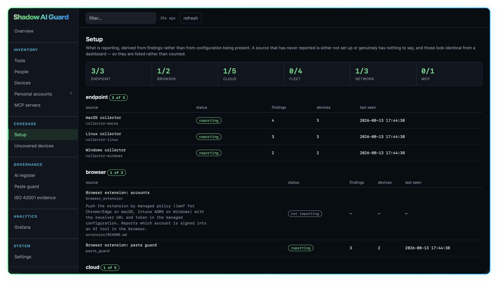

<a id="top"></a>

<p align="center">
  
</p>

<hr>
<p align="center">
  <strong>See the AI your organisation is actually using.</strong><br>
  Browser. CLI. IDE. Desktop. Network. Cloud. MCP.
</p>

<p align="center">
  <a href="#install-it"><strong>Install it</strong></a> ·
  <a href="#try-it-in-five-minutes"><strong>Run the demo</strong></a> ·
  <a href="#documentation"><strong>Read the docs</strong></a>
</p>

> [!NOTE]
> **Beta release.** Under active development. It runs in production, the
> finding schema is stable, and known limitations are tracked in
> [Issues](../../issues).

---

<p align="center">
  
</p>

Shadow AI Guard detects AI usage across the places it actually appears, then
correlates the findings so you can see the tools, accounts, users, devices and
sources behind it - and, for the tools you pay for, whether the seats on the
invoice match the people actually using them.

You install it once and run the whole thing from the portal: connect your log
store, set your corporate domains, approve tools, review what discovery finds,
enroll and revoke devices, manage who can sign in, and download pre-configured
deployment files for every surface. After the install you never need this
repository again.

It is self-hosted and free. There is no SaaS platform behind it and nothing
leaves your infrastructure.

## Contents

<p align="center">
  <a href="#install-it">Install it</a> ·
  <a href="#what-it-sees">What it sees</a> ·
  <a href="#everything-runs-from-the-portal">The portal</a> ·
  <a href="#try-it-in-five-minutes">Try it</a> ·
  <a href="#how-it-works">How it works</a>
  <br>
  <a href="#prefer-files-to-a-portal">Classic mode</a> ·
  <a href="#documentation">Documentation</a> ·
  <a href="#what-you-need">Requirements</a> ·
  <a href="#finding-schema">Finding schema</a> ·
  <a href="#governance-and-privacy">Governance</a> ·
  <a href="#status-and-known-limitations">Limitations</a>
</p>

## Install it

One command, then the portal takes over:

```bash
helm install ai-guard oci://ghcr.io/amansk5/shadow-ai-guard/charts/ai-guard \
  --namespace ai-guard --create-namespace \
  --set ingress.enabled=true --set ingress.host=ai-guard.your.domain \
  --set portal.ingress.enabled=true --set portal.ingress.host=ai-guard-portal.your.domain
```

The receiver prints a one-time setup code to its log. Open the portal, create
the owner account with it, and the first-run wizard walks you through the
rest in seven steps: receiver URL, log store, corporate domains, tool
approvals, the browser extension, alerting, and ready-to-run downloads for
the collectors and the scanners. Two of those are marked required, because a
deployment missing them runs wrong rather than not running. You can leave the
wizard at any point and pick it up again under Settings > Getting started.

```bash
kubectl logs deploy/ai-guard -n ai-guard | grep setup_code
```

Docker Compose works the same way: `docker compose up -d` in
`deploy/compose/`, then the same setup code and wizard.
[Getting started](docs/getting-started.md) walks the whole flow end to end.

## What it sees

No single commercial tool sees all of the places AI tools turn up. CASB and
DLP products see the browser. Endpoint tools see installed applications.
Cloud access tools see OAuth grants. None of them read `~/.claude.json` to
tell you which account your developers' AI CLIs are signed into - and the
account is the part that matters: an approved tool on a personal account is
still unmanaged data flow, invisible spend and an offboarding gap.

| Surface | What Shadow AI Guard can observe |
|---|---|
| **Browser** | AI websites, managed extensions, account domains and Paste Guard events |
| **CLI** | Local AI tooling and the account it is signed into |
| **IDE** | AI coding extensions and integrations |
| **Desktop** | Installed AI applications and local configuration |
| **Network** | AI domains and local process attribution through SentinelOne |
| **Cloud** | Entra sign-ins, delegated access, OAuth grants, Exchange evidence, Intune and Jamf |
| **MCP** | MCP servers and security findings |

Every source emits the same finding shape, so new scanners and collectors plug
into the same downstream pipeline.

## Everything runs from the portal

The portal is not a dashboard bolted onto the side. It is where the platform
is operated:

- **Setup and coverage.** The wizard configures the deployment, and the
  Sources page tells you which detection sources are reporting, which are set
  up but silent, and which you have not enabled yet. A source that reports
  nothing might be clean or might be broken; those look identical in a log
  stream, so the portal tells you the difference.
- **The estate.** Tools, people, devices, personal accounts and MCP servers,
  correlated from the raw findings. The overview shows what changed this
  week, not just totals, and tools that need a look sort first with the
  reasons spelled out.
- **The review queue.** Discovery watches your fleet's DNS and your endpoint
  configs for AI tools the registry does not know yet, and queues them for a
  human decision. One click adds a tool to detection; nothing is detected
  until a person decides.
- **Governance.** The AI register records what each tool is, how it is used,
  and what was decided about it: owner, status, review date. Personal-account
  findings carry their own lifecycle - acknowledge one, or accept it with a
  reason and it leaves the open count.
- **Budget.** What each AI tool costs, joined against what the estate is
  observed doing: seats nobody uses, people using a tool no seat covers, and
  personal accounts running alongside paid ones. User lists sync from a
  vendor's admin API where one exists and import from its member export where
  it does not, and one subscription covers every tool its licence entitles,
  so a Claude seat is counted once across Claude and Claude Code.
- **Identity.** The platform never guesses who owns a machine, but it will
  propose: download the suggested device-to-person map, correct it, and
  upload it back in the portal. A mounted file still works; what you save in
  the portal wins over it.
- **The fleet.** Devices enroll with their own credential and can be revoked
  individually. Enrollment tokens are invitations; devices are badges; both
  are managed here.
- **Accounts.** Three roles. The **owner** is the account the setup code
  creates and the one that cannot be locked out: an admin cannot make
  another owner, so the last one cannot be removed. **Admins** run the
  platform. **Viewers** read every page and can change nothing - made for
  the auditor and the exec. Nobody can act on an account that outranks
  them, or grant a role above their own, which is what stops an admin
  reaching an owner by resetting a password or changing a role. Sign-in is
  a username and password, or Microsoft Entra where you would rather not
  keep a second set of credentials - a six-step wizard sets that up, each
  step checked against the provider rather than accepted as typed. It
  authenticates and never provisions: no sign-in creates an account. You
  can require it, in which case one account keeps its password as the way
  back in, and set how recently somebody must have signed in at the
  provider before the portal will take it - twelve hours by default, and
  verified rather than merely requested. Every change lands in an audit
  trail with who did it.
- **Telling people they have an account.** Point it at a mail relay and
  creating an account emails the person to say so. The wizard knows the
  common providers and fills in the host, port and encryption for the one
  you pick; a Kubernetes deployment can mount the credential from the
  Secret it already has instead. It never blocks: the account is created
  whether or not the relay answers, the portal says plainly when nobody was
  emailed, and one button later sends the invites that were missed. The
  invite carries no token, no password and no link that grants anything,
  and the wording is yours to rewrite.
- **What is still not set up.** Finishing the wizard means "stop showing me
  the wizard", not "everything is configured". A bell in the header lists
  what is outstanding and what each gap makes the platform get wrong rather
  than refuse to do. It pulses once, until it has been opened, and then
  never again.
- **Notifications.** A webhook fires the moment discovery finds something
  new, and a weekly digest summarises the estate to Slack or anything
  webhook-compatible.
- **Finding your way around.** A guided walkthrough runs on a first sign-in
  and covers every section of the portal, in the words of the role taking
  it: an admin is told what to change, a viewer who to ask. The overview is
  arranged per person - drag the cards, stack them, resize or hide them -
  and that arrangement is yours, not the deployment's. Both are available
  again at any time under Settings > Getting started.

Grafana is optional and complementary: better at graphs and history, and the
portal can embed its panels. The portal is better at relationships, current
state, and doing something about what it shows.

## Try it in five minutes

You do not need a Kubernetes cluster, an MDM, or any cloud credentials to see
what the project does. The demo runs the real receiver, portal, Loki and
Grafana against synthetic data:

```bash
git clone https://github.com/AmanSK5/shadow-ai-guard.git
cd shadow-ai-guard/demo
docker compose up
```

Then open:

- **Shadow AI Guard Portal:** http://localhost:8091
- **Grafana:** http://localhost:3000
- **Paste Guard demo:** http://localhost:8090/demo/

The demo runs managed mode like a real deployment, so it starts with the same
setup code and wizard, and the seeder posts fake findings across every
surface and OS so you do not land on an empty install.

### Portal

Use the portal to explore people, devices, tools, source health and the
relationships between them.

https://github.com/user-attachments/assets/ffd150f1-f4c1-4459-8a10-039e68c48c03

### Grafana

Grafana is the deeper telemetry view: usage over time, personal versus work
accounts, per-tool breakdowns and MCP findings. Import
`dashboards/ai-guard.json` in a real deployment; the demo comes with it
provisioned.

### Paste Guard

The demo also serves a stand-in AI prompt box running the browser extension's
real, unmodified `guard.js`. Paste a fake AWS key or payment card number and
watch it get stopped before it reaches the page. The panel underneath shows
the report that would have been sent, which never contains what you pasted.

https://github.com/user-attachments/assets/16dd7857-935b-40c8-ad73-524b30271ec7

---

<p align="right"><a href="#top">Back to top ↑</a></p>

## How it works

```text
browser extension ─┐
macOS collector  ──┤
Windows collector ─┤
Linux collector  ──┼──► receiver ──► logs (Loki) ──┬──► portal
cloud scanners  ───┤       │                       │
network scanner ───┤       │                       └──► Grafana
MCP scanner ───────┘       │
                           └──────► Alertmanager ──► alerts
                             ▲
                             │
                  registry + portal decisions
```

- **receiver**: FastAPI service. Accepts findings, logs them as structured
  JSON, fires alerts for personal accounts, serves the registry to
  collectors, and in managed mode holds the platform's one piece of state:
  enrollment, accounts, settings and decisions, in a single SQLite file.
- **registry**: what counts as an AI tool: domains, extension IDs, config
  file paths. A compiled copy ships with the chart, and the portal adds your
  own entries on top at runtime, so adding a tool never touches an endpoint.
- **portal**: the operating view described above. It reads findings from the
  log store, proxies decisions to the receiver, and is not in the ingest
  path, so collection carries on if it falls over.
- **endpoint**: collectors for macOS, Windows and Linux. These read local AI
  tool configuration to report which account each tool is signed into. This
  is the data most API-level products do not have.
- **scanner**: cloud and fleet scanners for Entra ID sign-ins, Exchange
  signup evidence, Intune and Jamf software inventory, SentinelOne DNS
  telemetry and MCP security checks. Each module is optional; run the ones
  your estate supports. The portal generates the CronJobs.
- **discovery**: a scheduled job that looks at your fleet's DNS activity,
  filters out domains the registry already knows, and classifies the rest.
  Anything that looks like an AI service lands in the portal's review queue
  as "new AI tool found on N devices". Nothing is detected until a person
  decides.
- **Grafana / Alertmanager**: optional analytics and paging.

## Prefer files to a portal?

Classic mode (`managed.enabled=false`, or the compose classic overlay) is the
same codebase with no server-side state at all. Every setting is a file or an
environment variable in your own repo: `governance.yaml` for decisions,
`registry/registry.yaml` for detection, `CORP_DOMAINS` and friends for
config. Changes go through your normal merge request review, which some teams
prefer as their audit trail. Managed is classic plus a small state database,
not a fork; if you are not sure which you want, start with managed. The
[deployment docs](docs/deployment/README.md) compare the two.

## Documentation

| I want to... | Start here |
|---|---|
| Go from zero to first finding | [Getting started](docs/getting-started.md) |
| Try it without company infrastructure | [Testing guide](TESTING.md) |
| Deploy it | [Deployment](docs/deployment/README.md) |
| Understand the architecture | [Architecture](docs/architecture.md) |
| Operate the portal | [Portal](portal/README.md) |
| Configure the receiver | [Receiver](receiver/README.md) |
| Record approvals, owners and review dates | [Governance decisions](docs/governance.md) |
| Track paid seats against observed use | [Budget](docs/budget.md) |
| Produce evidence for an AI management system | [Evidence](docs/evidence.md) |
| Deploy macOS collection | [macOS collector](endpoint/macos/README.md) |
| Deploy Windows collection | [Windows collector](endpoint/windows/README.md) |
| Deploy Linux collection | [Linux collector](endpoint/linux/README.md) |
| Deploy the browser extension | [Browser extension](extension/README.md) |
| Configure cloud and network scanners | [Scanner docs](scanner/README.md) |
| Write another scanner | [Writing a scanner](docs/writing-a-scanner.md) |
| Review the trust model | [Security model](SECURITY.md) |
| Assess privacy impact | [Privacy and DPIA guidance](docs/deployment-privacy.md) |
| Something isn't working | [Troubleshooting](TROUBLESHOOTING.md) |

## What you need

- **Somewhere to run two containers**: a Kubernetes cluster or a host with
  Docker Compose. Prebuilt multi-arch images are published to GHCR, so
  nothing needs building.
- **A Loki-compatible log store** for findings. Connect one you already run
  through the wizard, or the compose file includes one.
- **At least one detection source** for the surfaces you care about, and
  credentials for whichever you enable. Currently supported: Microsoft Graph
  (Entra, Exchange, Intune), Jamf Pro, SentinelOne, Chrome/Edge managed
  extension policy, and endpoint collectors for macOS, Windows and Linux.
- Grafana and Alertmanager if you want the analytics dashboard and paging.
  Both optional.

## Finding schema

Every source uses the same shape. Any scanner or collector that emits it works
with everything downstream.

```json
{
  "tool": "claude-code",
  "surface": "cli",
  "os": "macos",
  "account_domain": "gmail.com",
  "device": "SERIAL123",
  "device_name": "ASK-SERIAL123",
  "user": "aman.test",
  "evidence": "~/.claude.json",
  "severity": "warn",
  "reported_at": "2026-01-01T09:00:00Z",
  "source": "collector-macos"
}
```

`severity` is `warn` when the account domain is not one of your corporate
domains, and `info` otherwise.

The `user` field carries an account name where the source can provide one, so
a finding can be followed up with the right person. See
[privacy](docs/deployment-privacy.md) for exactly when it is populated.

`device` carries the most stable identifier the source can obtain, usually a
hardware serial, because that is what Jamf, Intune, SentinelOne and most RMMs
key on. `device_name` carries the hostname, which is what a human recognises
and what a platform with no serial can still join on.

## Governance and privacy

The registry ships with every tool set to `approved: false`. Approval is your
organisation's decision, not this project's default. Discovery can propose
new tools; it never approves them automatically.

The findings, register and audit trail can provide evidence for an AI
management system such as ISO/IEC 42001: what tools have been observed, where
they were seen, which accounts are being used, what was decided and by whom.
Shadow AI Guard does **not** determine ISO/IEC 42001 compliance on its own;
organisational controls, risk decisions, policies, training and management
review still require human ownership.

Before deploying, read
[docs/deployment-privacy.md](docs/deployment-privacy.md). This is workplace
monitoring in most jurisdictions and usually warrants a DPIA.

## Status and known limitations

This is a beta. It runs in production, and the rough edges are listed here
rather than hidden.

The list keeps shrinking: registry fallback drift, the Entra scanner counting
failed sign-ins as usage, unreported delegated access, and browser extension
inventory have all been fixed and tested since the first release.

Current known limitations:

- **Single sign-on is beta.** Microsoft Entra sign-in has now been run end
  to end against a real app registration - one, which is not the same as
  proven - so pilot it on one account before moving anybody across. It
  authenticates rather than provisions: the account must already exist with
  a matching email address, and the first successful sign-in binds it to
  that Entra identity permanently. Passwords keep working alongside it
  unless you require single sign-on, and the account the setup code created
  keeps its password either way as the way back in.
- **Outbound mail is one hop.** Invites are sent through a relay you
  configure, synchronously, with no queue and no retry. A relay that is down
  when an account is created means that person was not emailed; the portal
  says so rather than implying otherwise, and a button resends to everybody
  who was missed. Delivery beyond the relay is between you and it - a test
  send reports what the relay said, which is not the same as landing in an
  inbox.
- **Snap Chromium profiles.** The collectors inventory installed browser
  extensions from Chrome, Chromium, Brave and Edge profiles, but snap Chromium
  on Linux keeps its profile under `~/snap` and is not read, so an AI extension
  there is invisible.
- **Sign-in coverage.** The Entra sign-in scan reads interactive sign-ins only.
  Non-interactive ones are covered separately as delegated access findings:
  one per user and app per day, carrying the OAuth scopes the app is using.
  Service principal and managed identity sign-ins are not read as usage; the
  service principal and consent scans show that a grant exists, not that
  anything is using it. The delegated access query needs the Graph beta
  endpoint because the `signInEventTypes` filter is not available on v1.0.
- **The Windows delivery path.** The Linux collector is driven end to end in CI
  and the macOS path has been run on a fresh cluster; the Windows collector has
  had the least real-world running. Pilot on one machine first.

> [!IMPORTANT]
> Treat findings as leads to follow up, not verdicts.

If you hit something wrong or missing, an issue with the finding JSON and what
you expected is genuinely useful.

<p align="right"><a href="#top">Back to top ↑</a></p>

## Security model

See [SECURITY.md](SECURITY.md).

Short version: devices enroll for their own revocable credentials (a shared
token covers the transition); public ingest should be rate-limited; findings
can carry usernames, account domains, device identifiers and hostnames, so
treat the log store and portal as sensitive; and endpoint collectors run as
root/SYSTEM through your MDM or RMM, so review them like anything else you
deploy at that privilege level.

<p align="right"><a href="#top">Back to top ↑</a></p>

## License

Shadow AI Guard is free and open source under Apache-2.0. Others may
legitimately charge for hosting, deployment, support or managed services, but
the software itself can always be obtained from this repository for free.
Before buying anything based on it, check what is actually being provided
beyond the code.

See [TRADEMARKS.md](TRADEMARKS.md) for how the project name may be used.
